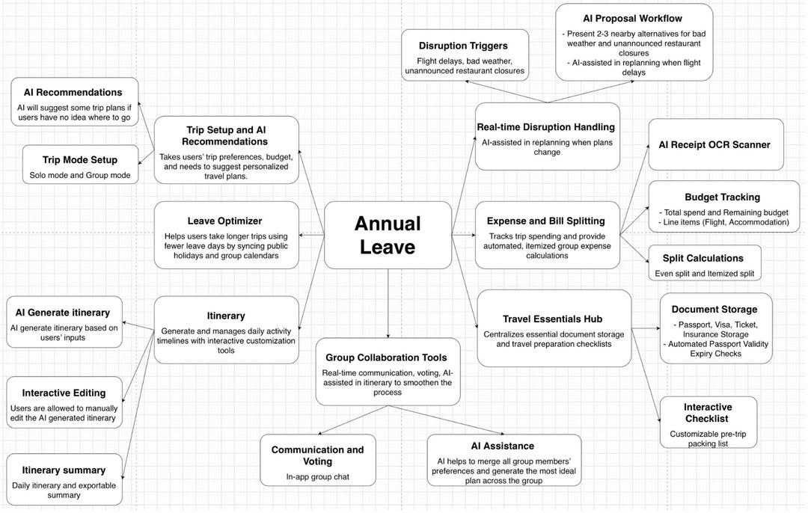
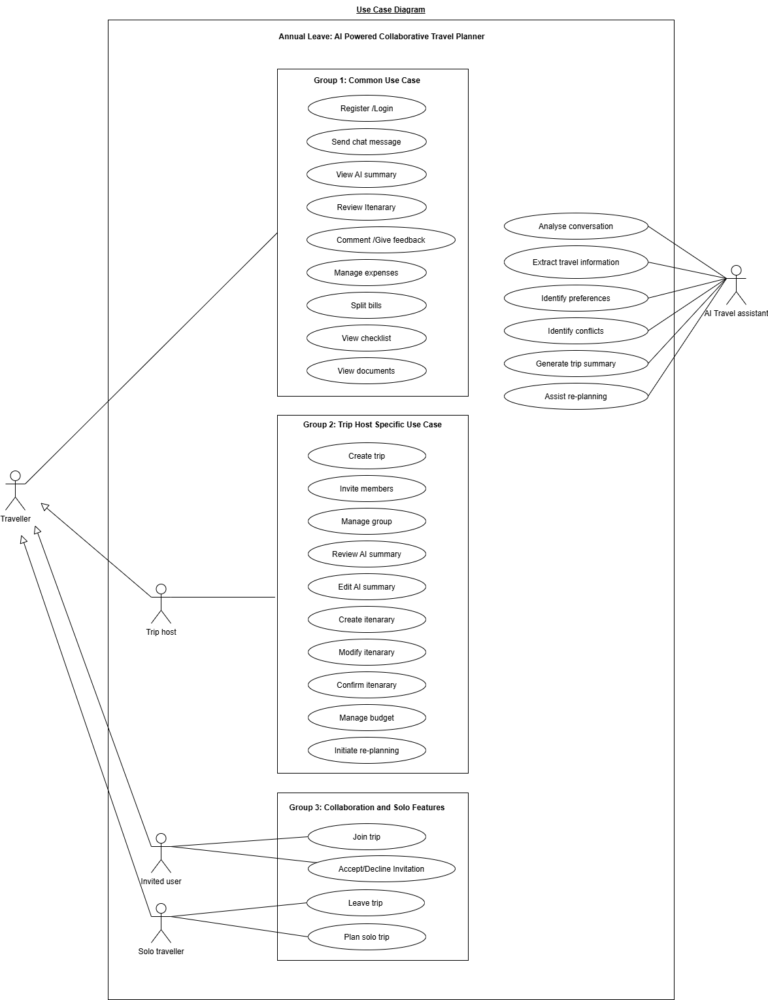
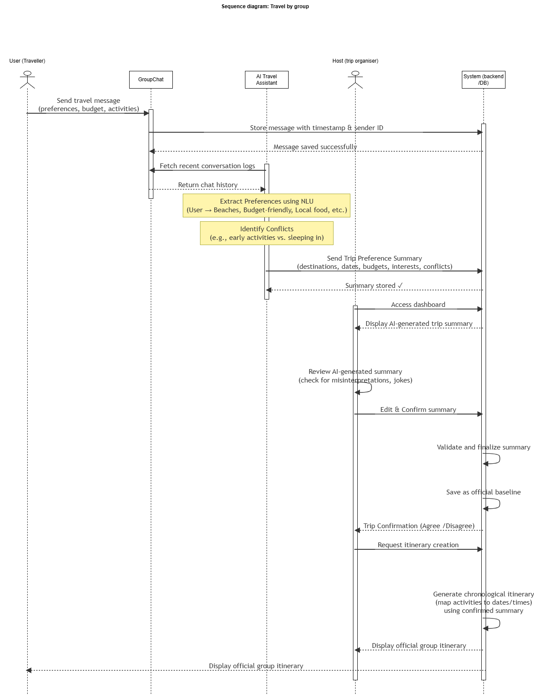
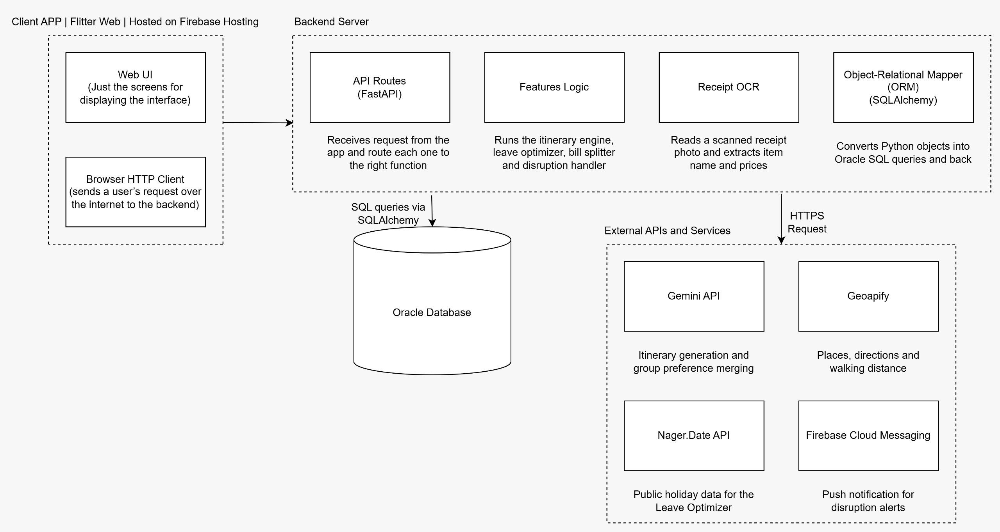

# **Annual Leave (Travel Planner) by The Deployers**

**Team:** Vning Ang, Ashley Cheng Wen Xing, Lilyvia Venezia Asun

**Problem Statement:** Travel Planner

**Video Presentation:** \[https://youtu.be/YIAlA8pIciw\]

**Presentation Slides:** \[https://canva.link/qmqjo18ksagqtop\]

## **1\. Project Overview**

**The Problem**

Planning a trip today is often troublesome because travellers usually have to rely on one app for flights, another for budgeting, a spreadsheet for the daily itinerary, and a group chat to tie everything together. Most of the apps on the market tend to focus on just one single task, like mapping a route or tracking receipts, rather than managing the whole trip end-to-end. This affects solo travellers, who must handle every step of the process alone.

Group travellers add even more difficulties. Balancing different schedules, budgets, and personal preferences usually results in endless messaging back and forth, rather than a smooth coordination process inside the app itself. Furthermore, current trip planners rarely help travellers manage real-time disruptions like delayed flights, bad weather, or closed venues, leaving people to fix their itineraries manually. These disruptions also involve service providers, such as attractions and restaurants, whose availability and closures are often the direct cause of the changes travellers must respond to.

**Existing Alternatives & Shortfalls**

The closest comparison is Wanderlog, currently one of the most widely used trip planners. It does map-based itinerary building very well, it can import bookings, map a route day by day, and let users reorder stops easily, while including budget tracking, packing lists, and shareable plans. For a group that has already decided where to go, it is a strong organiser.

However, Independent reviews note that Wanderlog's AI trip builder is capped on the free tier, and once a trip is actually planned, its usefulness drops, travellers are pushed toward other apps to manage the rest of the trip. It has no leave-day optimisation for working professionals, no built-in workflow for reacting to a disruption once you're already travelling, and no accessibility- or pacing-aware planning for a lower-mobility companion. In other words, it plans the trip once, but doesn't help you build the trip around your real leave calendar, keep a group aligned as preferences come in, or replan when something changes.

**The Solution**

Our solution is an all-in-one travel app designed to manage the entire lifecycle of a trip. It guides users from finding the best dates to take off work to generating AI-driven itineraries, managing budgets, coordinating group input, and handling unexpected changes during the journey. The app works no matter whether you are travelling alone or with a group. By gathering user preferences through text, voice notes, or a quick quiz, the app creates a fully customizable itinerary where budget details, bookings, and travel documents all live in one convenient place. For group trips, the platform automatically merges everyone’s schedules and preferences into a single plan, eliminating the need for negotiations over chat. Table 1.1 below shows the features of the solution.

**Table 1.1: Key features of Annual Leave App**

| **Features** | **Description** |
| --- | --- |
| Leave Optimizer | A smart leave and holiday calendar that combines public holidays, weekends, busy days, and remaining annual leave to recommend the most efficient leave combinations, while also overlaying group members’ availability from the group chat to find the best shared dates for everyone. 
| AI-generated Itinerary | The AI builds a personalised trip from voice, text, or quiz input, eliminating the hassle of manually comparing flights, hotels, and activities. If travellers have no destination in mind, ‘Top Picks For You’ recommends complete trip packages based on their preferences. Once generated, the itinerary is fully drag-and-edit, while a side search panel allows them to quickly find and replace flights, stays, or activities. 
| Comfort Setting | Accessibility controls (max walking time, activities per day, rest breaks, step-free transport, restroom/seating priority) aimed at travellers bringing elderly parents and children. 
| Trip Budget | After the itinerary is confirmed, the total trip cost will be automatically calculated and broken down into line items with live statuses such as booked, pending, planned, and estimated. Travellers can book flights, hotels, and activities directly through button that links to third-party websites on the same page, while the app keeps track of each booking’s status and updates the overall budget accordingly.
| Expenses | Users can scan a bill or upload it from their gallery, allowing the app to automatically digitalise the receipt and itemise the expenses. They can then assign specific items to individuals, split costs by percentage, and record who actually paid. Expenses can be settled immediately or tracked throughout the trip, with a summarised balance that automatically calculates who owes whom for easy settlement after the trip. 
| Disruption Handling | When disruptions such as flight delays, bad weather, or restaurant closures occur, the app identifies affected parts of the itinerary, suggests alternatives based on user preferences and nearby options, and provides actionable steps to resolve the disruption while automatically rearranging the itinerary. 
| Travel Checklist and Documentation | Pre-preparation checklist with progress tracking. Passport, Visa, and ticket storage with a validity check against trip dates. 
| Group Collaboration | A shared chat with polls enables collaborators to make group decisions, while per-item agree/disagree comments capture feedback directly on the itinerary. AI merges each member’s preferences and decisions into a trip summary, highlighting important details for confirmation before generating the itinerary. It can then suggest attractions and activities that match the group’s combined preferences. 

## **2\. Ideation & Process**

### **2.1 Ideas We Considered**

| **Idea** | **Why it was dropped / kept** |
| --- | --- |
| **A - AI-assisted trip planning**  AI Trip Planner \| Users manually enter core trip details such as destinations, dates, and budget, or import dates from the Leave Optimizer, then provide their preferences through voice, text, or quizzes. The AI takes over the search-heavy work by selecting flights based on their budget and priorities, and finding hotels, attractions, and restaurants that match their preferences. All AI selections remain fully editable, allowing users to override or replace any recommendation. | Kept because it significantly reduces the manual searching, price comparison, and decision fatigue in the original travel-planning flow. Instead of users having to search across multiple platforms for suitable flights, hotels, restaurants, and attractions, they provide their trip constraints and personal preferences once, and the AI handles the time-consuming research and matching. At the same time, the system does not fully automate the decision-making process: users can review, replace, or override every AI selection, giving them the convenience of automation without losing control over their final itinerary. 
| **B - Trip summary**  An AI-assisted summary of existing information from the group chat. It identifies missing trip details such as budget, dates, and accommodation, while a progress indicator shows what has been decided and what still needs attention. The AI analyzes chat history and member preferences to recommend activities, identifies unresolved discussions, and prompts polls when group consensus is needed. | Kept because it transforms the Trip Summary from a passive information recap into an interactive planning tool. Instead of simply showing what the group has discussed, it actively identifies gaps, surfaces unresolved decisions, and guides the group toward completing the information needed to generate the itinerary. 
| **C - Manual trip planning**  The initial concept for both solo and group modes was a search-and-rearrange experience: users manually entered destinations, transportation between stops, dates, and budget, then searched for flights, hotels, attractions, and restaurants. They could drag and drop selected options onto their preferred days, while AI handled availability checking and automatically rearranged attractions when needed, followed by budget and expense summaries. | Dropped as the primary flow because it placed most of the searching, comparison, and decision-making on users. However, the original search-and-drag interaction was retained because it provides useful flexibility after the AI generates the itinerary. Users can still search for alternatives, check availability, replace selections, and rearrange the itinerary, making manual control an editing layer rather than the centre of the planning experience. |
| **D - Carbon Footprint features**  Introduced to align with the growing focus on sustainability and SDGs, this feature calculated the carbon footprint across the entire journey and suggested more environmentally friendly alternatives, particularly for transportation. | Dropped because it did not provide enough direct value to the target users compared with the additional complexity it introduced. In travel planning, users are more likely to prioritise cost, travel time, convenience, and comfort when choosing transportation. Since carbon impact was not a primary decision factor for the intended users, the feature was deprioritised in favour of features that more directly improve the planning experience. |
|

### 

### **2.2 Ideation Boards**

**Mind Map**

This mind map shows the overall structure of the app, branching from the core concept into its major feature clusters: Trip Setup and AI Recommendations, Leave Optimizer, Itinerary, Group Collaboration Tools, Real-time Disruption Handling, Expense and Bill Splitting, and Travel Essentials Hub. Each branch is broken down further into its sub-features, giving an overview of how the individual ideas fit together into one solution.

**User Flow Diagram (Solo Traveller Mode - Part 1)**

###
**User Flow Diagram (Solo Traveller Mode - Part 2)**

###
**User Flow Diagram (Solo Traveller Mode - Part 3)**

This diagram traces the screen-by-screen journey of a solo traveller, from opening the app and signing in, through selecting travel dates (either self-chosen or drawn from the Leave Optimizer), to entering a destination, preferences, and comfort settings. It then follows itinerary generation, review and editing, and concludes with a budget review and an optional checklist before the trip is confirmed. Following on from trip confirmation, this section shows the ongoing disruption-monitoring loop: the system continuously checks whether a disruption has occurred (flight delay, weather, or restaurant closure); if so, the user selects the affected issue, reviews the impacted bookings, and the itinerary updates automatically before returning to the confirmed state.

**User Flow Diagram (Group Travellers Mode - Part 1)**

**User Flow Diagram (Group Travellers Mode - Part 2)**

**User Flow Diagram (Group Travellers Mode - Part 3)**

The diagram shows the stage by stage of group-mode planning, the processes are almost the same as solo traveller mode. One of the differences is there will be a group chat for communication across the group. Moreover, the members can raise disagreements through comments or polls where needed before the host edits and confirms the finalized trip. Furthermore, there is a feature about splitting the bill either even split or itemized split, and the bill is settled among members.

**Use Case Diagram**

The diagram maps system capabilities across two main actors, which are the Traveller and the AI Travel Assistant. The Traveller role, which involves Trip Hosts, Invited Users, and Solo Travellers, accesses common features (such as registration, chat, viewing itineraries and summaries, submitting feedback, managing expenses, and viewing checklists), host-specific tasks (creating trips, editing summaries, finalizing itineraries, managing budgets, and initiating re-planning), and role-specific options (joining or leaving a trip and planning solo). Operating as a separate backend actor, the AI Travel Assistant manages automated tasks including conversation analysis, data extraction, preference and conflict identification, summary generation, and re-planning assistance.

**Sequence Diagram (Group Travellers Mode)**

### 

This diagram shows the message flow triggered when a user sends trip-related information into the group chat. The system stores the message, after which the AI Travel Assistant retrieves the recent conversation history, extracts preferences using natural language understanding, and flags any conflicts between members. The resulting trip preference summary is sent to the host for review, editing, and confirmation; once confirmed, the host requests itinerary creation, and the system generates a chronological itinerary from the validated summary, which is then displayed to the group as the official plan.

### **2.3 Mentor Consultation**

<table><thead><tr><th>
<strong>Date</strong>
</th><th>
<strong>Mentor</strong>
</th><th>
<strong>Feedback Received</strong>
</th><th>
<strong>What Was Changed</strong>
</th></tr><tr><th>
7 September 2026
</th><th>
Teh Ming En
</th><th><ul><li>Advised us to avoid simply replicating features that are already common in existing travel apps and instead provide a stronger reason for users to choose our app.</li><li>Suggested making the planning process more automatic, rather than requiring users to manually find flights, attractions, and restaurants before the app rearranges them into an itinerary.</li><li>Recommended using a brighter colour palette with a bright background to make the interface more attractive.</li><li>Emphasised focusing on the core problem and intuitive UI before going too deeply into technical implementation.</li><li>Suggested removing the Carbon Footprint feature, as users may not necessarily change their travel behaviour based on carbon footprint considerations, and exploring SDG-related features that provide clearer benefits to both users and developers.</li></ul></th><th><ul><li>Changed the interface from a dark theme to a light theme with a white background and green as the contrast colour.</li><li>Removed the manual planning process. Instead of requiring users to actively search for and organise flights, attractions, and restaurants, we collect their preferences through voice input, typing, or a quiz, reducing the amount of thinking and effort required from users.</li><li>Shifted the app towards a more automated planning experience, where user preferences become the basis for generating the trip plan instead of requiring users to directly compare flights, hotels, and attractions. By understanding what the user wants, the app can select suitable options for them and build the trip plan automatically.</li><li>Removed the Carbon Footprint feature and focused on features that directly improve the user's trip-planning experience.</li></ul>

</th></tr><tr><th>
12 September 2026
</th><th>
Zach Khong
</th><th><ul><li>Should focus on the group chat features</li><li>Suggested integrating AI directly into the chat as an ongoing planning assistant, where it can proactively support the group. For example, by raising polls when needed, instead of using AI only as a second-step tool to summarize the conversation afterwards.</li><li>Every feature should be presented as a problem-driven solution. Instead of simply stating the problem and then listing the features, we should clearly show how each feature addresses a specific user problem and why it is needed.</li><li>It is important to clearly communicate why the product deserves to be built by demonstrating its value and potential impact, as well as defining how we will measure its success.</li></ul></th><th><ul><li>Implement AI to detect unresolved decisions or conflicting preferences and automatically raise a poll that sticks to the top of the chat.</li><li>Allow users to swipe left on a message and ask AI to analyse the selected message together with the surrounding conversation, then respond directly in the group chat.</li><li>Use AI to track the information collected throughout the conversation and indicate which decisions or details are still missing before the itinerary can proceed.</li><li>Consolidate confirmed decisions, unresolved issues, and key information from the conversation into a structured summary that can be used for itinerary generation.</li><li>Analyse the group chat history to suggest attractions and restaurants that match the group’s stated preferences, budget, location, and previous decisions, with a match bar showing how well each recommendation fits the group.</li></ul></th></tr></thead></table>

## **3\. Design & Prototype**

**UI Prototype:** \[ https://www.figma.com/design/AdtczDGVAS65v1LppHOzsg/Code-Nection?node-id=0-1&t=DZFTmRN9hmkoRpxZ-1\]

<table><tbody>

<tr><td>
<strong>1. Group Chat</strong>

<ul>
<li>Expenses: Track and manage expenses throughout the trip, including shared costs and bill splitting.</li>
<li>Favourites: Access a centralized collection of attractions, restaurants, activities, and other places saved by your group.</li>
<li>Sticky AI Polls: AI detects when your group needs to make a decision and automatically turns the conversation into a poll. The poll stays pinned above the chat until everyone has voted, ensuring the group reaches a shared decision.</li>
<li>Member Preferences: Members can set their calendar and date preferences. AI considers everyone’s availability when planning the trip and flags any date conflicts in the Trip Summary if the selected dates don’t fit a member’s schedule.</li>
<li>AI Message Response: Swipe any chat message to the left to reveal the Leaf icon, instantly summoning AI to craft context-aware responses for your group planning.</li>
</ul>
</td></tr>

<tr><td>
<strong>2. Trip Summary</strong>
<strong></strong>
<ul>
<li>AI-Powered Summary: Continuously analyse the group conversation to identify confirmed details such as destinations, dates, budget, group size, and other planning decisions, then automatically consolidate them into a centralised trip summary, eliminating the hassle of scrolling through long chat conversations and manually keeping track of group decisions.</li>
<li>Trip Readiness Progress: A live progress bar shows how far the group has progressed and highlights what still needs to be decided. Users can tap the summary to expand it and view the complete trip details.</li>
<li>Planning Status Tracker: Displays real-time updates on pending decisions, such as budget, accommodation, and transportation, allowing users to tap an item and resolve it directly.</li>
<li>Confirmed Details: Provides an overview of locked-in information, including the destination, travel dates, group size, and trip duration.</li>
<li>AI Conflict Resolution: Detects conflicting preferences or unresolved opinions, such as different budget ranges, and suggests launching a quick poll to help the group reach a consensus.</li>
<li>Personalised Suggestions: Analyses the group’s collective preferences and chat history to recommend relevant attractions, restaurants, and activities through the Suggestions tab.</li>
<li>Host-Controlled Itinerary Generation: Once all key planning requirements are completed and the Ready button is activated, the trip host can generate the final itinerary.</li>
</ul>
</td></tr>

<tr><td>
<strong>3. Leave Optimizer</strong>
 

<ul>
<li>Interactive Calendar: Tap and drag across dates to mark your busy periods in red.</li>
<li>Leave Balance Tracker: Input your total annual leave and view your remaining balance instantly in the top right corner.</li>
<li>AI Recommended Leave Combos: Browse smart itineraries at the bottom that strategically combine your annual leave with weekends and public holidays to maximise your time off.</li>
</ul>
</td></tr>

<tr><td>
<strong>4. Itinerary</strong>
 
<strong></strong>
<strong></strong>
<ul>
<li>Instant Smart Itinerary: Get a personalized day-by-day itinerary generated by AI based on your trip details, preferences, and requirements, without planning everything from scratch.</li>
<li>Effortless Drag-and-Drop Swaps: Not a fan of a scheduled activity? Browse alternative recommendations in the sidebar and simply drag and drop a new activity onto the existing one to replace it instantly.</li>
<li>Expandable Sidebar View: Expand the sidebar to explore a detailed catalog of activities, attractions, hotels, and flights, making it easy to browse, compare, and fine-tune your itinerary.</li>
</ul>
</td></tr>

<tr><td>
<strong>5. Replan</strong>
<strong></strong>
<ul>
<li>Automated vs. Manual Disruption Detection: Flight issues are flagged automatically, while other ground-level updates may require manual user reporting.</li>
<li>Impact Analysis &amp; Guided Actions: Surfaces downstream effects on affected bookings, such as hotel check-ins, transit, and reservations, while offering quick recovery actions like rebooking flights or requesting refunds.</li>
<li>Proactive Alternative Suggestions: Triggers nearby recommendations when unforeseen changes or closures occur, suggesting comparable activities or restaurants with walking distance, travel time, and operating hours.</li>
<li>One-Go Itinerary Restructuring: Automatically restructures and realigns the entire itinerary in a single step once replacement activities or adjustments are confirmed.</li>
</ul>
</td></tr>

<tr><td>
<strong>6. Track Expenses</strong>
<strong></strong>
<ul>
<li>Instant Receipt Scanning: Scan physical receipts using your camera or upload from your gallery to automatically digitize items, prices, and totals.</li>
<li>Granular Assignment &amp; Custom Splits: Assign specific expenses to individual members or adjust custom percentages at the bottom when an even split doesn't apply.</li>
<li>Payer &amp; Responsibility Tracking: Clearly record who paid upfront and who is responsible for each item line by line.</li>
<li>Financial Summary &amp; Settlement: Track overall balances to see who owes whom, with clear status tags distinguishing between <em>Settled</em> and <em>Pending Split</em> expenses.</li>
<li>One-Go Settlement: Resolve shared finances all at once instead of splitting every individual purchase, with quick navigation back to original digital receipts upon tapping.</li>
<li>Budget Control: AI will keep track of the expenses and if it detects the expenses may exceed, it will post a notification.</li>
</ul>
</td></tr>

<tr><td>
<strong>7. Flexible Preference Capture Hub</strong>
 
<strong></strong>
<ul>
<li>Multiple Input Methods: Easily input your travel preferences by speaking into the microphone to record your thoughts, typing out text, or taking a quick interactive quiz.</li>
<li>Instant Itinerary Generation: Tap the central generation button to translate your preferences into a customized travel plan immediately.</li>
</ul>
</td></tr>

<tr><td>
<strong>8. Comfort Settings</strong>
 
<strong></strong>
<ul>
<li>Tailored for Relaxed Paces: Designed specifically for trips involving elderly travelers, young children, or those seeking a slower, low-stress pace.</li>
<li>Walking &amp; Activity Limits: Adjust the maximum walking distance between stops (from 5 to 30 minutes) and set a daily maximum cap on scheduled activities.</li>
<li>Rest Break Frequency: Automatically schedule regular rest intervals during travel days (e.g., every 1, 2, or 3 hours).</li>
<li>Accessibility Toggles: Enable filters for step-free accessible transport, priority routing near public restrooms, and stair-minimization options.</li>
</ul>
</td></tr>

</tbody></table>

## **4\. What Makes It Different**

**Table 4.1: Novel Features and The Twist**

| **Feature** | **What is original about it** |
| --- | --- |
| Leave Optimizer | Most travel apps ask users to choose their travel dates first. This feature works in reverse by asking: “You have 14 days of annual leave, but how many days off can you actually get?” It combines public holidays, weekends, busy days, and remaining annual leave to identify the most efficient leave combinations. For example, taking just 1 day off to get 4 days off in total. 
| Group Leave Overlay | If users are planning a group trip, the app can show more than one person's calendars at the same time. So instead of texting "are you free on these dates?" back and forth, users just look at one screen and see which days work for everyone. 
| AI-merged group preferences | Normally, planning a group trip means a lot of back-and-forth messaging to agree on a budget, hotel, or food. Here, each person fills in their own preferences (their budget, allergies, must-see places), and the AI combines everyone's answers into one plan automatically. 
| In-app disruption handling | If a flight gets delayed, or it starts raining, or a restaurant booked suddenly closes, this app shows you exactly which bookings are affected and assists in fixing it (reschedule, cancel, AI suggest something nearby) instead of leaving you to Google a solution yourself. 
| Comfort Settings | This is built for someone bringing an elderly parent on a trip. Users can set things like "don't make us walk more than 15 minutes between stops" or "we need step-free transport," and the app plans around that automatically. 
| Group Chats and Trip Summary | Group trips usually require extensive back-and-forth to reconcile different budgets, food preferences, must-see places, and constraints. Here, each member provides their preferences separately, and AI automatically analyses and merges them, displaying the combined preferences as labels in the Trip Summary while using them to suggest suitable attractions, restaurants, and activities. As the group chats, AI continuously monitors the conversation, automatically identifies confirmed and unresolved decisions, tracks planning progress, and detects when a group decision is needed. When members are stuck, it can automatically suggest options or trigger a poll, while confirmed decisions are automatically consolidated into the Trip Summary, keeping the group’s preferences and choices organised without requiring users to manually track them.
| Expenses/Bill splitting | Instead of manually calculating who owes what or switching to a separate expense app, users can snap a photo of a receipt, and the app automatically reads and itemises the bill. Costs can be split evenly across the group or assigned item by item, while the app records who paid and calculates each person’s outstanding balance. Users can choose to settle expenses immediately or later, as every expense and outstanding amount is continuously recorded and consolidated, allowing the group to settle all remaining balances at the end of the trip. |
| 

**Table 4.2: Comparison with existing solutions**

| **Features** | **Annual Leave** | **Wanderlog** | **TripIt** |
| --- | --- | --- | --- |
| AI Itinerary generation | √   | Available but capped on free tier | × Organises bookings you already have, does not generate a plan |
| Leave-day / holiday optimization | √   | ×   | ×   |
| Group calendar overlay | √   | ×   | ×   |
| Auto-merged group preferences | √   | Collaborative editing, but no automatic merge of individual preferences | × Built for a single traveller’s bookings |
| Disruption replanning | √   | ×   | Flight-delay alerts, but no rebooking / replanning workflow |
| Accessibility / elderly-pacing settings | √   | ×   | ×   |
| Budget tracking | √   | √   | limited |
| Itemized bill splitting | √   | ×   | ×   |
| Single app for the whole plannings | √   | × Strong at planning, weak after booking | ×   |
|

Wanderlog and TripIt each cover only part of the trip-planning process. Wanderlog is useful for building an itinerary and tracking a budget, while TripIt mainly stores booking confirmations like flights and hotels in one place. Neither one helps with deciding when to travel, generating a plan automatically, combining a group's different preferences into one itinerary, or reacting when something goes wrong mid-trip, such as a flight delay or a closed restaurant. Accessibility planning, such as adjusting the pace of a trip for an elderly companion, is also missing from both.

Hence, Annual Leave is the solution among the three that supports the full trip process from start to finish, including leave-day optimization, AI-generated itineraries, automatic merging of group preferences, mid-trip disruption handling, and accessibility settings. However, some individual features in the competing apps are still more developed. For example, Wanderlog's map-based route planning and budget tracking are more developed than what has been designed so far for Annual Leave. The main difference is not that every single feature is stronger, but that Annual Leave is the only option that covers the entire journey in one.

## **5\. Technical Architecture & Feasibility**

### **Tech stack**

**Frontend**

Flutter Web will serve as the frontend to deliver a responsive, mobile-first user experience accessible directly through any web browser. It excels at app-like experiences such as interactive canvas applications (like Figma-style tools). However, a potential constraint to consider is larger initial bundle sizes, which may slightly increase page load times on slower internet connections.

**Backend**

Python using FastAPI is considered because it makes integrating AI tools like OpenAI fast and straightforward. It has powerful tools to handle tasks like parsing preferences, generating itineraries, and updating schedules on the disruption. FastAPI also keeps API calls fast and responsive. However, if multiple users generate travel itineraries at the exact same time, response times could lag if background processing isn't handled correctly.

**Database**

Oracle SQL Database was selected to store and organize user profiles, trip itineraries, group preferences, and shared expenses, ensuring data remains accurate and reliable when linking complex travel information. However, setting up and managing an Oracle database requires significant server resources. If multiple users access the system simultaneously, the database risks running out of available connections, which can lead to noticeable request delays during live testing.

**APIs**

For API and third-party services, an AI model like the Gemini API is being considered to generate itineraries, combine group preferences, and re-plan schedules around disruptions because of its generous free tier for student prototyping. However, the main constraints of the Gemini free tier are strict rate limits (typically capped at 10 to 15 requests per minute depending on the model). For location-based features such as searching attractions, calculating walking distance, and showing transit options, Geoapify is proposed instead of Google Maps Platform, as it offers similar places search, geocoding, and routing functionality without requiring a credit card to activate its free tier. The main constraint is that Geoapify's place database is smaller than Google's, so some newer or smaller local businesses may not appear in search results. For the Leave Optimizer's public holiday calendar, Nager.Date is proposed, since it is a completely free API that requires no sign-up or API key and returns public holiday data for most countries.

### **System Architecture diagram**

### 

### **Build plan & scope**

**Table 5.1: In scope (What will actually be built)**

| **Feature** | **What ships in building phase** |
| --- | --- |
| Login | Email/password sign-up and login (Google/】
| Solo trip creation | Destination, dates, budget, preferences via text input, voice input or the quiz format |
| Group trip creation | Add trip members, each submits preferences, AI merges into one itinerary |
| Leave Optimizer | Calendar view of public holidays and user-entered annual leave, with recommended leave-day combos. Group calendar overlay included |
| AI-generated itinerary | Day-by-day plan generated via Gemini, fully editable (drag to reorder, add/remove items) |
| Budget and Expenses | Manual line items with status tags (booked/pending/planned) and has no live price-checking |
| Group decision tools | Comment agree/disagree on itinerary items, poll creation |
| Disruption handling | Flight delays, bad weather, and restaurant closures |
| Split a Bill | Even split and Itemized split |
| Checklist and Documents | Checklist with progress bar and document upload |
|

**Table 5.2: Out of scope**

| **Feature** | **Description** |
| --- | --- |
| Real flight / hotel booking or payment | This becomes a recommendation engine, not a booking platform |
| Live flight pricing | Mock/sample pricing is used instead, clearly labeled as such |
| Multi-language support | Single-language (English) build only |
| Native iOS/Android build | Flutter Web only |
| Push notification/rich reminders | Basic Firebase hookup for one alert type only, not a full notification settings |
